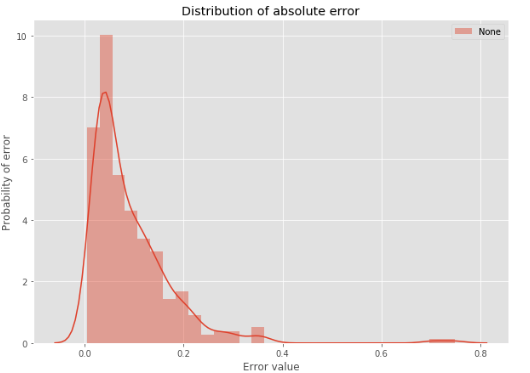

# Radial

`Radial` is a framework for constructing solutions to predict the entry into the radial mode.

It allows to:
* predict a value of the entry into the radial mode based on the pressure derivative vs time data.
* drop outliers using Isolation Forest.
* preprocess data, i.e. normalize, drop negatives, sample an equal grid to feed models, etc.
* load data from XLSX and save it to NPZ format.
* make a cross-validation approach to find optimal parameters for the neural network.

## About Radial

> Radial is based on [BatchFlow](https://github.com/analysiscenter/batchflow).

Radial has three modules [``core``](https://github.com/analysiscenter/radial/tree/master/radial/core), [``preprocessing``](https://github.com/analysiscenter/radial/tree/master/radial/preprocessing) and [``pipelines``](https://github.com/analysiscenter/radial/tree/master/radial/pipelines).

``core`` module contains ``RadialBatch`` class. This class includes methods that allows to load, normalize, interpolate and transform input data to feed the model.

``preprocessing`` module is designed to work with raw data. This module has two files for preprocessing:
* ``xls_to_npz.py`` - contains a function to convert raw data from XLS format to NPZ format
* ``make_isolation.py`` - filters outliers using Isolation Forest algorithm.

``pipelines`` module provides predefined workflows to:
* preprocess pressure derivative and time data.
* train a model and perform an inference to find the entry into the radial mode.

## Basic usage

### Preprocessing

#### Preprocessing xls files

To prepare data that is stored in XLSX run following command:
```bash
foo@bar:~$ python xls_to_npz.py -l path/to/whole_data.xlsx -s path/to/save
Done!
```

If you have a different files with train and test, use following command:
```bash
foo@bar:~$ python xls_to_npz.py -l path/to/TEST_data.xlsx path/to/TRAIN_data.xlsx  -s path/to/save
Done!
```

or if you want to save test and train path of data to different directories.

```bash
foo@bar:~$ python xls_to_npz.py -l path/to/TEST_data.xlsx path/to/TRAIN_data.xlsx  -s path/to/TEST_save path/to/TRAIN_save
Done!
```

#### Removing outliers

The next step is optional. If you have a large dataset then dropping outliers during model training may slow down the whole process. To avoid this problem perform denoising in advance using `drop_outliers.py`. Otherwise, this function is available in the ``RadialBatch`` and can be added to the common workflow.
Following command runs this function with NPZ-data:
```bash
foo@bar:~$ python drop_outliers.py -l path/to/npz_data -s path/to/save
Done!
```

As in previous time, `drop outliers.py` might be used with several paths:
```bash
foo@bar:~$ python drop_outliers.py -l path/to/npz_TEST_data path/to/npz_TEST_data -s path/to/save
Done!
```

or if you want to save test and train path of data to different directories.

```bash
foo@bar:~$ python drop_outliers.py -l path/to/npz_TEST_data path/to/npz_TRAIN_data -s path/to/TEST_save path/to/TRAIN_save
Done!
```

### Train model

Here is an example of a pipeline that loads data, makes preprocessing and trains a model for 100 epochs:
```python
train_pipeline = (Pipeline()
                     .load(fmt='npz')
                     .drop_negative(src=['time', 'derivative'])
                     .drop_outliers(src=['time', 'derivative'])
                     .to_log10(src=['time', 'derivative', 'target'],
                               dst=['time', 'derivative', 'target'])
                     .normalize(src=['time', 'derivative', 'target'],
                                dst=['time', 'derivative', 'target'],
                                src_range=[None, None, 'derivative_q'],
                                dst_range=[None, 'derivative_q', None])
                     .get_samples(n_samples, n_samples=1, sampler=sampler, src=['time', 'derivative'])
                     .make_points(src=['time', 'derivative'], dst=['points'])
                     .make_target(src='target')
                     .init_variable('loss', init_on_each_run=list)
                     .init_model('dynamic', RadialModel, model_name, config=model_config)
                     .train_model('model', fetches='loss', feed_dict=feed_dict,
                                  save_to=V('loss'), mode='w')
                  ) << data

train_pipeline.run(50, n_epochs=100, drop_last=True, shuffle=True, bar=True)
```

### Predict

Say you have data stored in numpy arrays `time` and `derivative` of shape (n_items, ) with dtype object (because arrays for every item have different length).
Then to get a predictions run

```python
    test_pipeline = (Pipeline()
                        .load(src=(time, derivative), components=['time', 'derivative'])
                        .drop_negative(src=['time', 'derivative'])
                        .drop_outliers(src=['time', 'derivative'])
                        .to_log10(src=['time', 'derivative'], dst=['time', 'derivative'])
                        .normalize(src=['time', 'derivative'],
                                   dst_range=[None, 'derivative_q'])
                        .get_samples(100, n_samples=1, sampler=np.random.random, src=['time', 'derivative'])
                        .make_points(src=['time', 'derivative'], dst=['points'])
                        .init_variable('predictions', init_on_each_run=list)
                        .init_model('dynamic', TFModel, 'model',
                                     config={'load' : {'path' : 'path_to_saved_model'},
                                             'build': False})
                        .init_variable('ind', init_on_each_run=list)
                        .update_variable('ind', B('indices'), mode='e')
                        .predict_model('model', fetches='predictions',
                                                feed_dict={'points': B('points')},
                                        save_to=B('predictions'), mode='w')
                        .clip_values(src=['predictions'])
                        .denormalize_component(src=['predictions'],
                                               src_range=['derivative_q'])
                        .update_variable('predictions', B('predictions'), mode='e')
                    )
    predicted_batch = (test_pipeline << dataset).next_batch(1)
    predictions = predicted_batch.predictions
```

Or if you want to use a console. Run following command inside prod directory.

> NOTE: This option works only with data that should be a NPY file with 2d numpy array with shape = (2, N).

```bash
foo@bar:~$ python predict.py -p ./path/to/data.npy -m /path/to/model (optional)
```

Process from preprocessing to prediction is described in this [notebook](./research/whole_process.ipynb).

## Model evaluation

The detailed description of parameters and models estimation is written in this [notebook](./standards/model_description.ipynb). The evaluation of best model is presented below. To estimate std we re-train model 10 times.

MAPE < 30 % | STD
------------ | -------------
91.932 | 0.564

And the histogram of distribution of percentage error.



## Installation

### Installation as a python package

With [pipenv](https://docs.pipenv.org/):

    pipenv install git+https://github.com/analysiscenter/radial.git#egg=radial

With [pip](https://pip.pypa.io/en/stable/):

    pip3 install git+https://github.com/analysiscenter/radial.git

After that just import `radial`:
```python
import radial
```

### Installation as a project repository

When cloning the repo from GitHub use flag ``--recursive`` to make sure that ``batchflow`` submodule is also cloned.

    git clone --recursive https://github.com/analysiscenter/radial.git


## Citing Radial

Please cite Radial in your publications if it helps your research.


    Khudorozhkov R., Broilovskiy A., Mylzenova D., Podvyaznikov D. Radial library for deep research
    of finding exit point to the radial mode. 2019.

```
@misc{radial_2019_1156085,
  author       = {Khudorozhkov R., Broilovskiy A., Mylzenova D., Podvyaznikov D.},
  title        = {Radial library for deep research of finding exit point to the radial mode},
  year         = 2019
}
```
